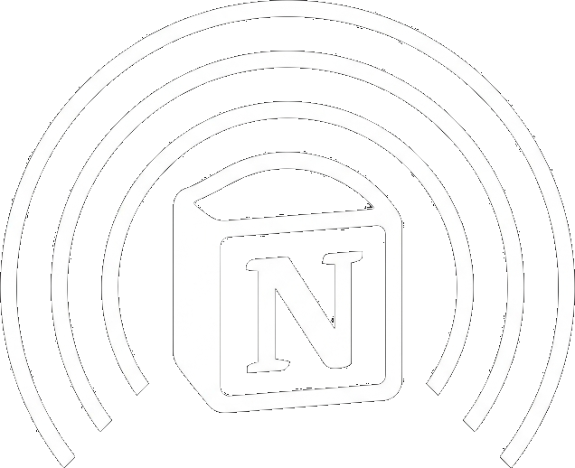
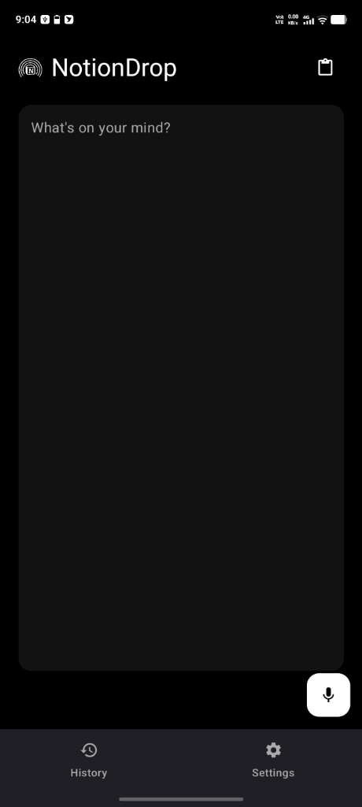
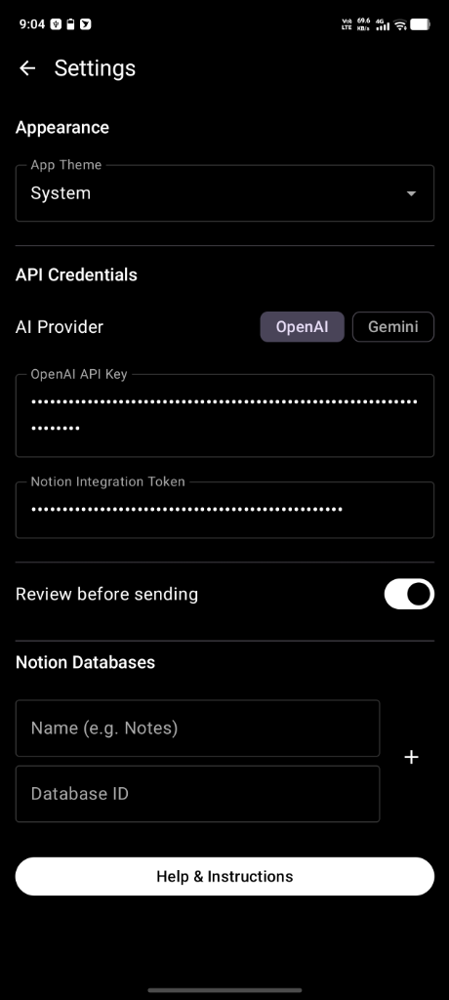

# NotionDrop

**A minimalist, AI-powered voice note app that structures your thoughts and drops them directly into Notion.**

<a href="https://github.com/sanjeeb-j/NotionDrop/releases/latest">
 <picture>
  <source media="(prefers-color-scheme: dark)" srcset="https://api.star-history.com/badge?repo=sanjeeb-j/NotionDrop&theme=dark" />
  <source media="(prefers-color-scheme: light)" srcset="https://api.star-history.com/badge?repo=sanjeeb-j/NotionDrop" />
  
 </picture>
</a>

[**Download**](https://github.com/Sanjeeb-J/NotionDrop/releases/latest/download/app-release.apk)

 

 

---

NotionDrop lets you capture your raw thoughts—either by voice or text—and uses the power of AI (OpenAI, NVIDIA NIM, or Google Gemini) to automatically structure them into beautiful, organized Notion blocks before dropping them right into your database.

Designed with a sleek, pure black-and-white minimalist UI, NotionDrop stays out of your way so you can focus entirely on capturing ideas.

## What you get

- 🎙️ **Voice-to-Text Native**: Instantly capture ideas using built-in Android voice recognition.
- 🧠 **AI Structuring**: Your raw braindumps are automatically converted into perfectly structured Markdown (titles, tags, headers, to-do lists, and dividers).
- 🔌 **Multi-Provider AI**: Support for OpenAI, Google AI Studio (Gemini), and NVIDIA NIM.
- 📓 **Direct Notion Sync**: Seamlessly pushes formatted content to any of your configured Notion databases.
- 🎨 **Minimalist UI**: Distraction-free, fully responsive Light and Dark themes built with Jetpack Compose.
- 🕒 **Local History**: Keeps a local record of everything you've dropped.

## Screenshots

Here is a quick look at the NotionDrop minimalist interface in action:

  
  

## How to use

1. Download the latest release [here](https://github.com/Sanjeeb-J/NotionDrop/releases/latest/download/app-release.apk).
2. Install the APK on your Android device.
3. Add your AI API key (OpenAI, NVIDIA NIM, or Gemini) in Settings.
4. Add your **Notion Internal Integration Token** and **Database ID** in Settings (Make sure you share your database with the integration!).
5. Hit the microphone icon, speak your mind, and drop it straight into Notion.

*Note: For the database to work correctly, ensure it has `Name` (Title property), `Tags` (Multi-select property), and `Date` (Date property).*

## Support

If you run into issues, make sure your Notion database properties exactly match the required names (case-sensitive) and that you have explicitly shared your target database page with your Notion Integration via the "Add connections" menu.

## Contributing

Want to help out? Feel free to open a pull request!
This app is built natively for Android using Kotlin, Jetpack Compose, MVVM Architecture, and Hilt for Dependency Injection.

### Building

Most of the time you don't need this — if you just want to use the app, grab the release above. This is for contributors.

1. Build it like any normal Android Studio project.
2. The app requires no external environment variables to compile, but you will need your own API keys to test the functionality.

## Analytics & privacy

NotionDrop does **not** collect your personal data or the contents of your notes.
All processing happens directly between your device, the AI provider you configure, and your Notion workspace. The app keeps a local history of your drops directly on your phone using a local Room Database, which never leaves your device.

## Supporters

## License

[MIT License](https://github.com/sanjeeb-j/NotionDrop/blob/main/LICENSE).

---

**Disclaimer:** This software is an independent open-source project and is not affiliated with, maintained, authorized, endorsed, or sponsored by Notion Labs Inc.
